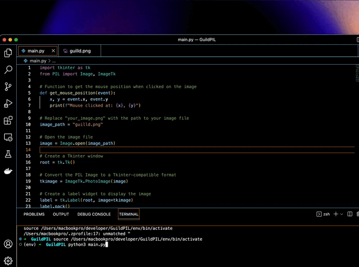

# Image X,Y Coordinate Finder

This tool allows you to find the x and y coordinates of a mouse click on an image displayed in a Tkinter window. It's useful for tasks that require pinpointing specific locations on an image.

## How to Use

1. **Installation:**

- Make sure you have Python installed on your system.
- Install the required libraries using pip
     ```python
     pip install Pillow
     ```

2. **Running the Tool:**

- Download the `app.py` files from this repository.
- Replace `"your_image.png"` in `app.py` with the path to your image file.
- Run the script using Python:
     ```bash
     python app.py
     ```

3. **Using the Tool:**

- A Tkinter window will open displaying the image.
- Click anywhere on the image to find the x and y coordinates of the mouse click.
- The coordinates will be printed in the console.

## Example



## Contact Me

If you have any questions, suggestions, or issues with the tool, feel free to contact me on Discord: [findkeys](https://discord.com/users/840848369484169266).
